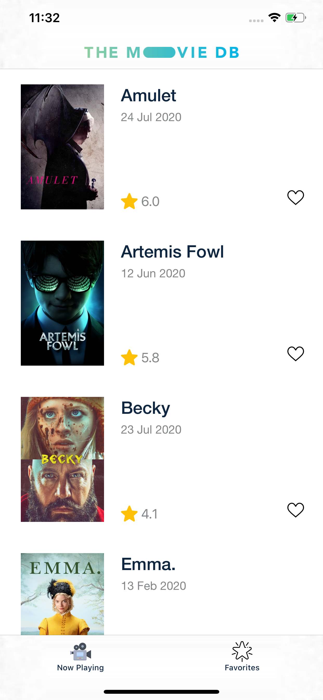
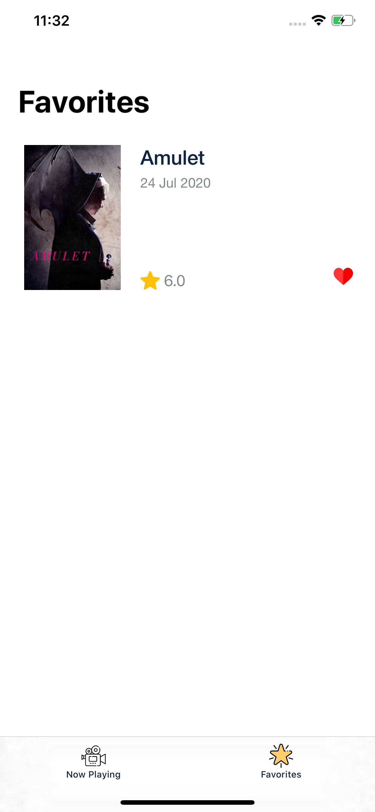

# MovieGuide
Demo application to allow users to discover now plyaing movies and movies details and add movies to favorite and rate a moive.

   

## Requirements

- iOS 13.0+
- Xcode 11.3.1

## Features

- [x] Show list of now playing movies sorted alphapectically.
- [x] Add Movie to Favorite. [This feature is implemented without depending on API, User can add movie to favorite from movie list]
- [x] Browse favorite list.
- [x] Browse Movie details. 
- [x] Show casting for each movie.
- [x] Show recommneded movies.
- [x] Show samiliar movies.
- [x] Rate a movie using guest session.

## Code 

- Code Written in Viper and swift
- Unit test [Not developed]

## Thridparties 

- Alamofire
- Cosmos
- Kingfisher

